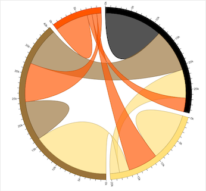

## Project Summary
The World Happiness Report is a survey of global happiness reported by the United Nations. The overall Happiness Score includes measures of: Family, Health (Life Expectancy), Freedom, Trust (Government Corruption), Generosity, and Dystopia Residual - which are other contributors to happiness not among those already listed. We would possibly like to explore how these happiness factors compare in different regions/countries; any significant changes in individual factors; and/or correlations between two or more happiness factors.

### Data Source
https://www.kaggle.com/unsdsn/world-happiness

### Inspiration
 
Source: https://developers.google.com/chart/interactive/docs/gallery/geochart

 
Source: https://observablehq.com/@d3/chord-diagram

 
Source: https://www.d3-graph-gallery.com/graph/correlogram_basic.html

### Draft Design 
A sketch of the final design

### GitHub Repo
https://github.com/ellemonke/full-stack-project

### Project Requirements
- Python Flask–powered RESTful API
- HTML/CSS, JavaScript (Include at least one JS library that we did not cover)
- at least one database (SQL, MongoDB, SQLite, etc.)

#### Timeline
**Data Analysis** (Back-End):  
**Chart Creation** (3 views):  
**Draft Presentation** (Front-End):  
**Final Presentation: Saturday, January 25**