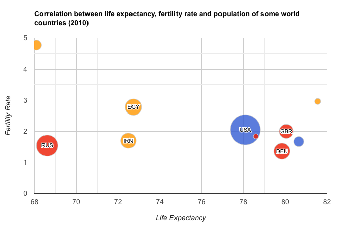

# World Happiness Visualizations
by Bryan Domogalla, Ellen Hsu, Rachel Hunter

## Project Summary
The World Happiness Report is a survey of global happiness reported by the United Nations. The overall Happiness Score includes measures of: Family, Health (Life Expectancy), Freedom, Trust (Government Corruption), Generosity, and Dystopia Residual - which are other contributors to happiness not among those already listed. 

We will be using D3 interactive visualizations to explore how these happiness factors compare in different regions/countries; any significant changes in individual factors; and/or correlations between two or more happiness factors.

### Data Source
https://www.kaggle.com/unsdsn/world-happiness

### Chart Inspiration
**Geochart:** 
 
Source: https://developers.google.com/chart/interactive/docs/gallery/geochart

**Correlation Diagram:** 
 
Source: https://www.d3-graph-gallery.com/graph/correlogram_basic.html

**Bubble Chart:** 
 
Source: https://developers.google.com/chart/interactive/docs/gallery/bubblechart

**Gauges:** 
 
Source: http://bl.ocks.org/NPashaP/59c2c7483fb61070486835d15c807941

### Dashboard Inspiration 
Our dashboard may consist of an interactive global map, filters, and sub-charts similar to this one.
 
Source: https://www.wto.org/english/res_e/statis_e/statis_bis_e.htm

### GitHub Repo
https://github.com/ellemonke/full-stack-project

### Timeline
**Data Analysis** (Pandas?): TBD, All 
**3+ Charts** (D3, other JS libaries): TBD, All 
**Draft Presentation** (HTML, Bootstrap, CSS): TBD, Ellen 
**Final Presentation: Saturday, January 25**